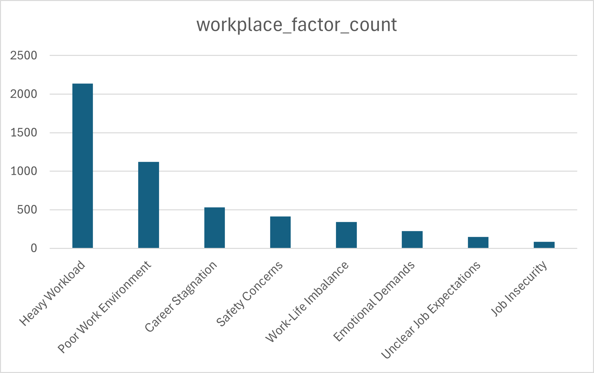
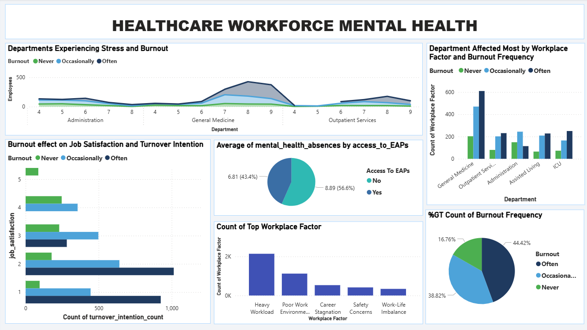

# Introduction
This analysis report shows the challenges in the healthcare sector. With this synthetic dataset, the focus of the analysis is to identify patterns and relationships between burnout, job satisfaction, and turnover intentions across different segments of the workforce.


# Background
This study aims to conduct a comprehensive analysis of the factors contributing to high levels of burnout and employee turnover within the healthcare workforce. 

That is to analyze;

•	High burnouts and Turnovers rate.

•	Identification of which department falls under the category the most.

•	Job roles and workplace conditions that are most at risk.

By identifying departments, roles, and work environments most affected by burnout and turnover, this analysis provides insights that can support targeted interventions, improve employee well-being, and enhance workforce retention within the healthcare sector.

## Key Quetions:

1.	Which job roles and department experience the highest stress and burnout rates?
2.	How does burnout frequency affect job satisfaction and turnover intentions?
3.	What are the top 5 workplace factors
4.	What Departments are Affected Most by The Top Workplace Factor?
5.	Do employees with access to Employee Assistance Programs show lower absenteeism rate?


# The Analysis

### 1.	Department With Highest Stress and Burnout Rates

This analysis was aimed at identifying which department in the health sector has a high rate of burnouts and stress. 

```
SELECT 
    COUNT(employee_id) AS employee_count,
    employee_type,
    department
FROM
    healthcare_data
WHERE
    stress_level >= 7 AND
    (
    burnout_frequency = 'Often' OR
    burnout_frequency = 'Occasionally'
    )
GROUP BY
    employee_type,
    department
ORDER BY
    employee_count DESC;

```

| Employee Type | Department | Number of Affected Employees |
| ------------- | ---------- | ---------------------------- |
| Register Nurse             | General Medicine             | 953                          |
| Critical Care Nurse        | ICU                          | 401                          |
| Nursing Assistant          | Assisted Living              | 363                          |
| Medical Assistant          | Outpatient Services          | 346                          |
| Physician (General)        | General Practice             | 294                          |
| Physician (Specialist)     | Speciality Care              | 250                          |
| Radiology Technicial       | Radiology                    | 294                          |

*Table of Job Role and Departments with high stress and burnout rate*


The analysis shows that the top three job roles experiencing high burnout and stress levels are Registered Nurse, Critical Care Nurse, and Nursing Assistant. These roles are predominantly concentrated within the General Medicine, Intensive Care Unit (ICU), and Assisted Living departments, recording combined stress and burnout counts of 953, 401, and 363 respectively.

In comparison, non-nursing roles such as General Physicians, Specialist Physicians, and Radiology Technicians—primarily within the General Practice, Specialty Care, and Radiology departments—exhibit lower but still notable stress and burnout counts of 294, 250, and 235 respectively.

***


### 2.	Burnout frequency effect on Job Satisfaction and Turnover Intention

After analyzing this data, it was visible as to how burnout frequency has a big influence on job satisfaction and turnover intentions.

Turnover Intention – Whether the employee is considering leaving their role (Yes/No).

Job Satisfaction – 1-5 scale rating job satisfaction:

•	1 = Very Dissatisfied  
•	5 = Very Satisfied 

Burnout Frequency – Categorical variable indicating how often an employee experiences burnout:

•	Never 

•	Occasionally 

•	Often 


```
SELECT 
    burnout_frequency,
    SUM(CASE WHEN turnover_intention = 'Yes' THEN 1 ELSE 0 END) AS turnover_yes_count,
    COUNT(*) AS low_satisfaction
FROM 
    healthcare_data
WHERE
    job_satisfaction <= 3
GROUP BY
    burnout_frequency;

```

On analyzing this dataset to find out the effect of how satisfied the employees are and whether the employee is considering leaving their role by the burnout frequency. First off, turnover intentions being yes or no were converted to numeric with *yes = 1* and *no = 0*. Then count where turnover intention being yes which gave an analytic report that shows employees with no burnout report have less rate of considering leaving their job and those employees who have a burnout frequency of often has a high rate of leaving their job role with *318* and *1685* counts respectively.

Similar with turnover intention rate, burnout frequency affects job satisfaction, as job satisfaction with *less than 3 (being the average)* shows higher number with burnout frequency of Often with a result of *2221* compared to burnout frequency of never, having a result count of *504*.


| Burnout Frequency | Employees with Turnover Intention (Yes) | Total Employees with Low Job Satisfaction |
| ----------------- | --------------------------------------- | ----------------------------------------- |
| Never             | 1685                                       | 2221                                         |
| Occasionally      | 1078                                       | 1585                                         |
| Often             | 318                                       | 504                                         |

*Table of Burnout effect on job satisfaction and turnover intention*

***


### 3.	Top Workplace Factors

There are various conditions and characteristics of the healthcare work environment that influences how employees feel and perform at work. This analysis shows the tops factors of the healthcare workplace.

```
SELECT
    workplace_factor,
    COUNT(*) AS wpf_count
FROM
    healthcare_data
GROUP BY
    workplace_factor
ORDER BY
    wpf_count DESC;

```


* Heavy Workload, Poor Work Environment and Carrer Stagnation are the leading factors of the healthcare workplace.

* Safety concerns, Work-Life Imbalance and Emotional Demands come next with a count of *415*, *340* and *223* showing how much the mental health of employees at the healthcare affects their performance at work.




*Bar representation of the top factors affecting employees behavour and work perfomance at work in the healthcare sector*

***


### 4.	Departments Affected Most by The Top Workplace Factor

After identifying the major factors affecting employees at work in the healthcare sector, I dove deep into those factors, identifying which departments are affected most by each of these workplace factors 

#### - Heavy Workload Factor :

With Heavy workload being at the top of the chart, this query dive specifically at heavy workload focusing at the departments most affected by it.

```
SELECT
    COUNT(*) AS workload_count,
    department
FROM 
    healthcare_data
WHERE
    workplace_factor = 'Heavy Workload'
GROUP BY
    department
ORDER BY
    workload_count DESC;

```

After analysis,  the department of General Medicine shows higher heavy workload rate with a count of 796, with Icu and Assisted Living folowig next recording count of 343 and 259

| Department | Number of Employees Reporting Heavy Workload |
| ---------- | -------------------------------------------- |
| General Medicine          | 796                                            |
| ICU          | 343                                            |
| Assisted Living          | 259                                            |

*Table showing departments with heavy workload factor*


#### - Poor Work Environment Factor :

This analysis shows what department is most affected by poor work environment at is is one of the major workplace factor in the healthcare sector

```
SELECT
    COUNT(*) AS work_envi_count,
    department
FROM 
    healthcare_data
WHERE
    workplace_factor = 'Poor Work Environment'
GROUP BY
    department
ORDER BY
    work_envi_count DESC;

```

Poor Work Environment affects General Medicine the most with a count of 234, as well as employees under Outpatient Service department having a count of 204.


| Department | Number of Employees Reporting Poor Work Enironment |
| ---------- | -------------------------------------------- |
| General Medicine          | 234                                            |
| Outpatient Service          | 204                                            |
| Speciality Care          | 193                                            |

#### - Carrer Stagnation Factor :

Employees of the healthcare sector feels stuck or unable to progress in their jobs over a long period. This query dives deep to show which department has this issue the most

```
SELECT
    COUNT(*) AS career_count,
    department
FROM 
    healthcare_data
WHERE
    workplace_factor = 'Career Stagnation'
GROUP BY
    department
ORDER BY
    career_count DESC;

```

Employees in Administartion, Radiology and general Medicine deparment has the highest rate of carrer stagnation with count of 275, 80 and 69 respectively. With employees in Outpatient Services department being at the buttom of the table at 45.


| Department | Number of Employees Reporting Carrer Stagnation |
| ---------- | -------------------------------------------- |
| Administration          | 275                                            |
| Radiology          | 80                                            |
| General Medicine          | 69                                            |
| Laboratory          | 62                                            |
| Outpatient Services          | 45                                            |

*Table showing the counts of employees reporting carrer stagnation by department*

***

### 5.	Employees with access to employee assistance programs, absenteeism rate

Analyzing the impact of employee assistance programs, this query shows if employees in such category shows a lower absenteeism rate.

```
SELECT
    access_to_eaps,
    AVG(mental_health_absences) AS avg_absences
FROM 
    healthcare_data
GROUP BY
    access_to_eaps;

```

Comparing the avaerage of both employees with access to assistance programs to employees without access. It is shown in the analysis that employees with access to employee assistance programs show lesser absenteeism rate with an average of 6.81, while employees with no access shows greater absenteeism rate at an average of 8.88 


| Access to Employee Assistance Programs | Average Mental Health Absence |
| ---------- | -------------------------------------------- |
| No          | 8.88                                            |
| Yes          | 6.81                                            |

*Table showing the absenteeism rate between employees with access to Employee Assisted programs and employees without*


# Conclusion

### INSIGHTS



#### 1. Department with the highest stress and burnout rate:
 The department with the highest stress rate is General Medicine, as employees in this department record higher burnout levels. This is influenced by several workplace factors, which are discussed below.

#### 2. Burnout Frequency Effect on Job Satisfaction and Turnover Intention:
Burnout frequency has a great impact on job satisfaction as well as turnover intention. Employees who experience higher burnout frequency also tend to report lower job satisfaction and are more likely to consider leaving their roles.

#### 3. Top Workplace Factor:
 Workplace factor is a major effect on employees in the healthcare sector. A heavy workload affects employees significantly, also a poor work environment, resulting in high burnout and stress among employees.

#### 4. Department Affected Most by The Top Workplace Factor: 

- Heavy Workload Factor: Employees in General Medicine, ICU, and Assisted Living departments are mostly affected by the heavy workload factor

- Poor Work Environment Factor: General medicine, outpatient service, and specialty care departments face a high challenge in a poor work environment

- Carrer Stagnation: Employees face career stagnation, unable to progress in their jobs over a long period, mostly in the administration department, as well as radiology and general medicine.

#### 5. Employees with access to employee assistance programs absenteeism rate:
Employees who have access to assisted programs show lower mental health absence, with an average of 6.81, compared to employees without access to these assisted programs.

